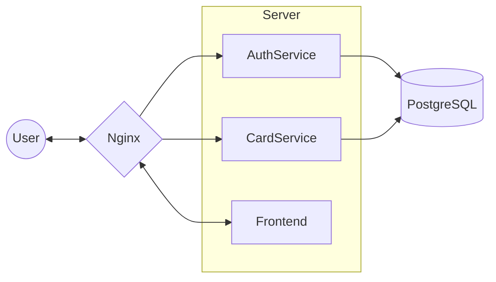
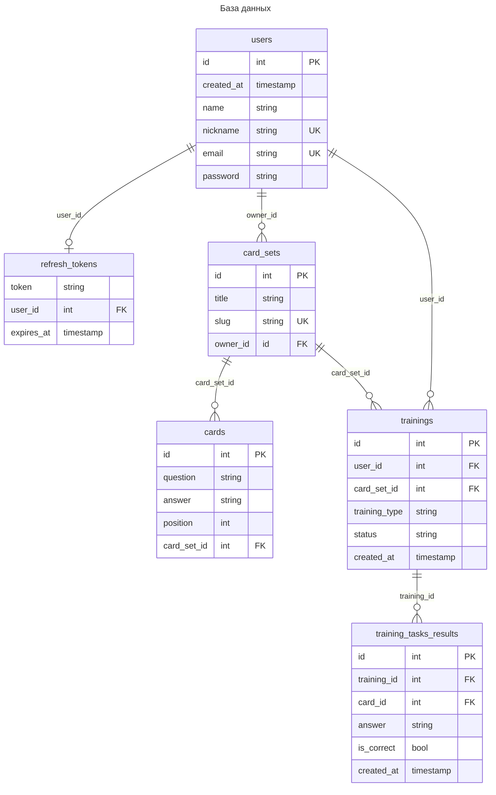

# Flipside

   

 

   

> Flipside - сервис для работы с флеш-карточками для запоминания

## Описание решения

Нашим решением является веб-сервис, в котором пользователи могут создавать наборы флеш-карточек для запоминания учебного
материала и проверять полученные знания с помощью тренировок.

## Инструкция по запуску

### Публичный доступ

Сервис доступен по адресу `79.137.204.109:80`

### Локальный запуск

Для развертывания локально необходимы docker и docker-compose.

Склонируйте репозиторий.

Создайте файл `.env`, содержащий настройки:

```bash
POSTGRES_USER=admin  # имя пользователя базы данных
POSTGRES_DB=flipside  # название базы данных
POSTGRES_PASSWORD=postgres123 # пароль доступа к базе данных

JWT_SIGN_KEY=asd  # ключ подписи JWT (алгоритм HS256)
JWT_EXPIRES_IN=60m  # срок действия jwt токена
REFRESH_TOKEN_EXPIRES_IN=24h  # срок действия refresh-токена
```

Запустите с помощью команды:

```bash
docker-compose up -d
```

Формат записи сроков действий (_timedelta_):

> Продолжительность задается положительным последовательностью чисел с временным интервалом. Допустимые значения
> интервалов: "ns", "us" (или"µs"), "ms", "s", "m", "h". Например, 24h, 1h30m, 720h (30 дней)


Теперь веб-интерфейс доступен по `localhost:80`, а запросы к api доступны по `localhost:80/api`

## Архитектура

Приложение разделено два сервиса: на сервис аутентификации и авторизации и сервис
работы с карточками, которые в свою очередь взаимодействуют с базой данных.



1. Запрос пользователя обрабатывается nginx-сервером и перенаправляются к веб-приложению или бэкенду.
2. Пользователь обращается к веб-приложению, реализованном на JavaScript-библиотеке React, и взаимодействует с
   интерфейсом.
3. Если пользователю необходимо в будущем получить доступ к защищенным ресурсами, он создает аккаунт или входит в него.
   При этом веб-приложение отправляет запрос на сервер, который обрабатывается сервисом аутентификации и авторизации, а
   полученную пару access и refresh токенов приложение сохраняет в локальном хранилище браузера.
4. Веб-приложение при взаимодействии с ресурсами (такими как наборы карточек, карточки и тренировки) использует
   HTTP-запросы к бэкенду. Для входных точек, требующих аутентификации, в заголовки запроса добавляется access-token,
   сохраненный ранее в локальном хранилище браузера.
5. Запрос обрабатывается соответствующим сервисом, который обращается к базе данных PostgreSQL для управления ресурсами,
   а затем отправляет ответ.
6. Веб-приложение обрабатывает полученные данные и предоставляет результат пользователю.

## Особенности реализации

### Авторизация

В проекте авторизация происходит с помощью **JWT** access-токена, который обновляется с помощью одноразового **refresh-токена**.
Оба токена выдаются сервисом авторизации. Этот подход позволяет проводить проверку доступа на разных уровнях приложения,
в том числе без обращения к сервису авторизации, например на уровне nginx-сервера или самих сервисов.

### Сборка

Контейнеры микросервисов собираются с помощью Dockerfile в несколько этапов:

Сначала создается образ, который устанвливает зависимости.
Затем происходит сборка приложения и копирование исполняемого файла в другой легковесный образ.
Второй образ используется для запуска контейнера.

Такой подход позволяет уменьшить размер образа и ускорить сборку.

### Фронтенд

Фронтенд реализован на языке **TypeScript** с использованием библиотек **React** и ReactRouter, а также сборщика **Vite**.

### Бэкенд

Сервисы авторизации и карточек реализованы на языке **Go** с использованием фреймворка **Gin**.

### База данных

На основе структуры сущностей была выбрана реляционная база данных, СУБД - PostgreSQL



## Контакты

В случае возникновения ошибок, создайте issue в репозитории или обращайтесь в telegram (@bibbob_pp)
